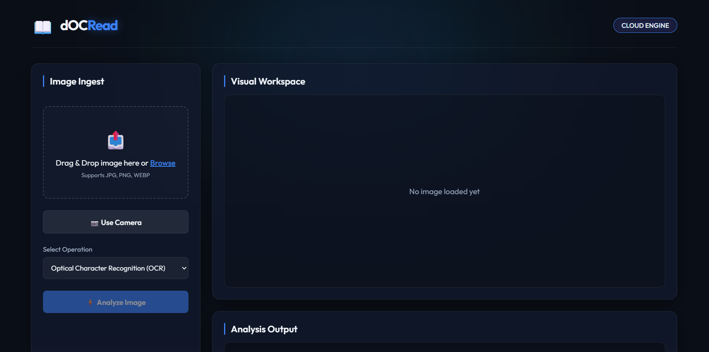
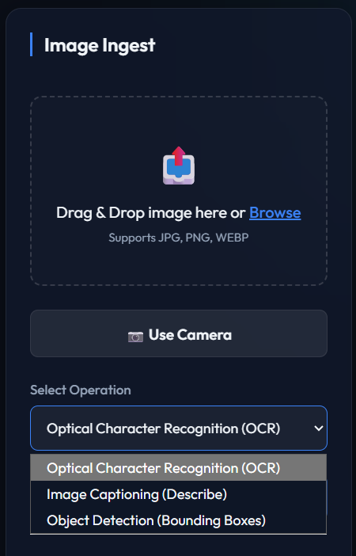
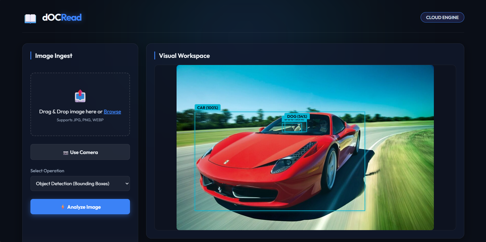
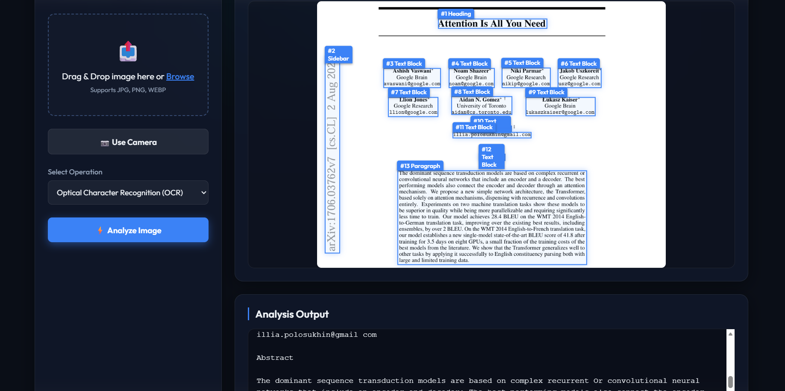
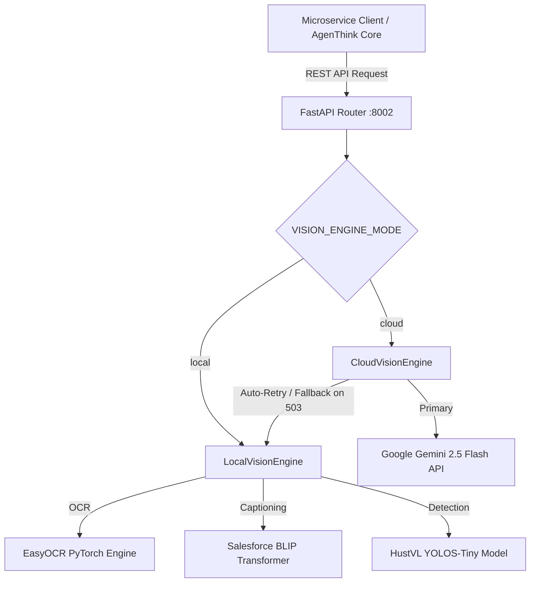

# 📸 dOCRead — AI Vision Lens & OCR Microservice

<div align="center">


**A high-performance, dual-mode Computer Vision and Document OCR service tailored for autonomous AI agent ecosystems.**

[Features](#-key-features) • [Visual Showcase](#-visual-showcase) • [Architecture](#-dual-mode-architecture) • [API Reference](#-api-endpoints) • [Quickstart](#-quickstart)

</div>

---

## 🌟 Overview

**dOCRead** is a specialized, standalone vision intelligence service engineered to empower AI agents (such as **AgenThink**) with human-like visual perception. Whether you need to extract dense text from scanned documents, generate contextual captions for complex scene analysis, or detect fine-grained object bounding boxes, `dOCRead` delivers zero-latency results through standardized REST APIs.

---

## ✨ Key Features

- **📑 2-Stage Document OCR (Text & Layout Box Detection + Recognition)**: Extracts multi-language text using a dual-phase approach. Stage 1 detects precise bounding boxes (`[ymin, xmin, ymax, xmax]`) for every text line or paragraph and renders them directly onto the image canvas in Cyber Blue (`#3b82f6`), just like object detection. Stage 2 recognizes exact character sequences inside each crop with high precision.
- **🖼️ Contextual Image Captioning (Describe)**: Generate detailed scene descriptions, analyze visual relationships, and answer custom visual prompts using advanced multimodal intelligence.
- **🎯 Precise Object Detection**: Locate semantic entities in any image, returning structured bounding coordinates `[ymin, xmin, ymax, xmax]` normalized from `0.0` to `1.0` alongside confidence scores.
- **⚡ Dual-Mode Engine with Auto-Fallback**: Automatically switches between cloud-based Gemini Multimodal intelligence and offline local AI models (`EasyOCR`, `BLIP`, `YOLOS`) when network issues or cloud rate limits (`503 High Demand`) occur.
- **🎨 Electric Cyber Blue Studio UI**: Includes a gorgeous, standalone Glassmorphism Web UI (`http://127.0.0.1:8002/`) synchronized with the **AgenThink Blue Theme** for real-time visual testing.

---

## 📸 Visual Showcase

Explore the interactive **dOCRead Studio UI** running in standalone mode:

<div align="center">
  <table>
    <tr>
      <td align="center" width="50%">
        
        <br/><b>🔮 Electric Blue Operation Selector & Drag-Drop Zone</b>
      </td>
      <td align="center" width="50%">
        
        <br/><b>🏎️ Real-Time Multimodal Analysis & Output View</b>
      </td>
    </tr>
    <tr>
      <td align="center" width="50%">
        
        <br/><b>📑 High-Precision Document OCR Extraction</b>
      </td>
      <td align="center" width="50%">
        
        <br/><b>🎯 Structured Object Detection Output</b>
      </td>
    </tr>
  </table>
</div>

---

## 🧠 Dual-Mode Architecture

`dOCRead` implements a robust **Factory Pattern** (`src/docread/engines/`) that dynamically initializes the active vision engine based on your `.env` configuration:



### 1. ☁️ Cloud Mode (`VISION_ENGINE_MODE=cloud`)
- Leverages Google's `gemini-2.5-flash` multimodal API via an OpenAI-compatible interface.
- **Auto-Fallback Mechanism**: If the cloud API experiences temporary overload (`HTTP 503 / High Demand`), `CloudVisionEngine` automatically retries and seamlessly falls back to the local models without dropping the user request.

### 2. 🖥️ Local Mode (`VISION_ENGINE_MODE=local`)
- Runs 100% offline and cost-free on local CPU/GPU hardware.
- Utilizes **EasyOCR** for multi-language text recognition, **Salesforce BLIP** (`blip-image-captioning-base`) for scene captioning, and **YOLOS-Tiny** (`yolos-tiny`) for object localization.

---

## 📡 API Endpoints

All endpoints support standard CORS and accept `multipart/form-data` uploads for seamless integration:

| Method | Endpoint | Description | Payload / Input |
| :---: | :--- | :--- | :--- |
| `GET` | `/api/health` | Check service health, active engine mode, model status, and API key verification. | None |
| `POST` | `/api/vision/ocr` | Extract plain text from an uploaded image file. | `file: UploadFile` |
| `POST` | `/api/vision/describe` | Generate a descriptive caption or answer custom questions about the image. | `file: UploadFile`<br/>`prompt: str (Optional)` |
| `POST` | `/api/vision/detect` | Detect semantic objects and return normalized bounding box coordinates. | `file: UploadFile` |

---

## 🚀 Quickstart

### 1. Clone & Environment Setup
Create a `.env` file in the project root (`dOCRead/.env`):

```ini
# Engine Mode: 'cloud' (recommended) or 'local'
VISION_ENGINE_MODE=cloud

# Gemini API Credentials (Required if using cloud mode)
GEMINI_API_KEY=your_gemini_api_key_here
GEMINI_BASE_URL=https://generativelanguage.googleapis.com/v1beta/openai/
GEMINI_MODEL=gemini-2.5-flash
```

### 2. Launch with UV (Recommended)
Run the standalone server instantly using `uv`:

```bash
uv run python app.py
```

The server will initialize on **Port 8002**:
- **Interactive Studio UI**: [http://127.0.0.1:8002/](http://127.0.0.1:8002/)
- **API Swagger Documentation**: [http://127.0.0.1:8002/docs](http://127.0.0.1:8002/docs)

### 3. Ecosystem Automation
To launch `dOCRead` alongside the full **AgenThink AI Ecosystem** (`Port 8000 -> 8004` + `Next.js UI`), run from the orchestrator directory:

```powershell
cd ../AgenThink
powershell -File scripts/start_ecosystem.ps1
```

---

<div align="center">
  <b>Built with ❤️ for the AgenThink Advanced Agentic Coding Ecosystem</b>
</div>
